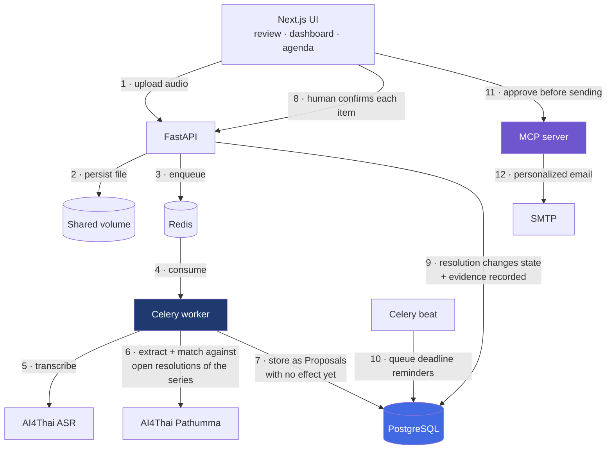
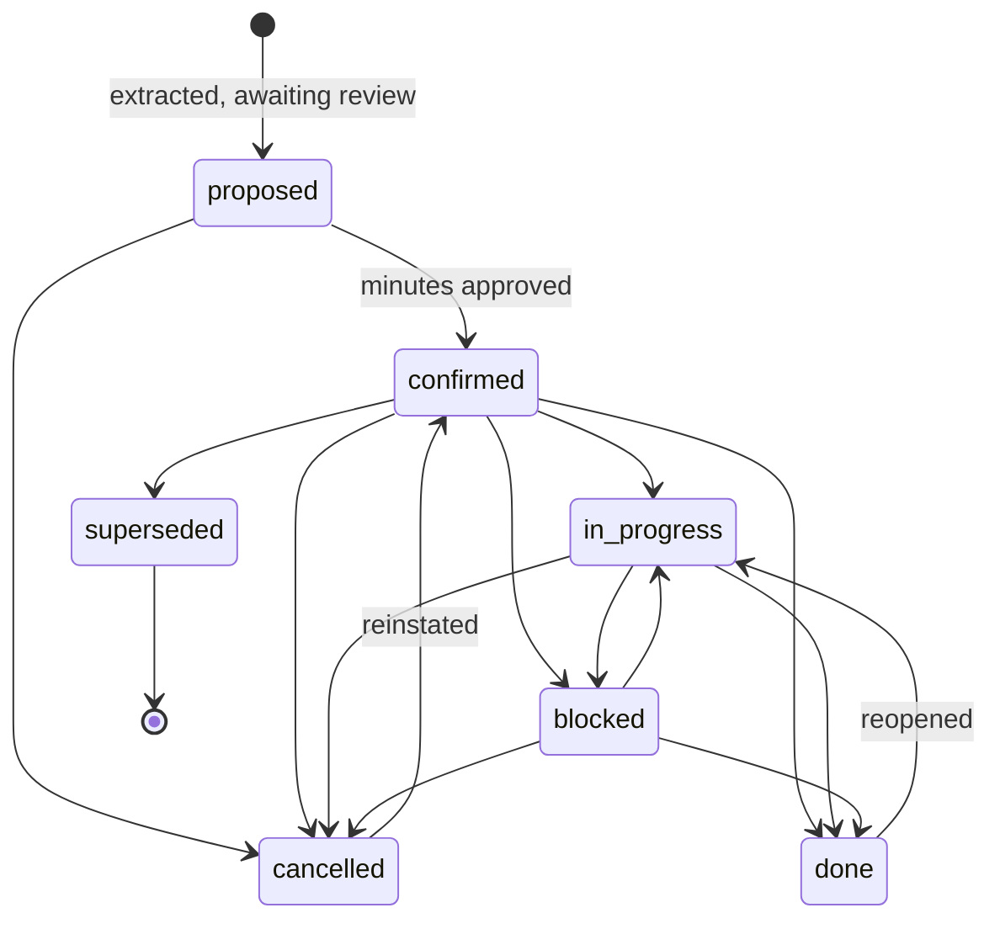

<div align="center">

# SARA

### Smart Autonomous Record Agent

**Turn meeting audio into compliant Thai government minutes — and track every resolution across meetings until it is actually closed.**

[](https://www.python.org/)
[](https://fastapi.tiangolo.com/)
[](https://nextjs.org/)
[](https://www.postgresql.org/)
[](https://docs.celeryq.dev/)
[](https://modelcontextprotocol.io/)
[](#-testing)
[](LICENSE)

[Quick Start](#-quick-start) · [Architecture](#-architecture) · [Domain Model](#-domain-model) · [API](#-api-reference) · [Testing](#-testing) · [Roadmap](#-roadmap)

</div>

---

## The Problem

Thai government committees meet monthly. Every meeting produces resolutions — binding decisions with an owner and a deadline. Those resolutions then **outlive the meeting that created them**, and someone has to carry them forward.

In practice, that someone is a secretary with a folder of `.docx` files. To prepare the next agenda they reopen months of past minutes by hand, looking for what is still unfinished. Items get lost. Deadlines slip silently. Nobody can answer *"what did we decide about the document system, and when?"* without reading everything again.

Meeting-summarizer tools do not solve this. They summarize one meeting and forget it.

> **SARA treats the resolution — not the meeting — as the primary entity.**
> A resolution has its own lifecycle, its own audit trail, and lives longer than the meeting that produced it.

### v1 → v2

| | v1 | v2 |
|---|---|---|
| **Core entity** | Meeting | **Resolution** |
| **Memory** | One meeting at a time | Cross-meeting linking within a series |
| **Output** | Summary email | Thai official agenda + minutes (`.docx`) |
| **Follow-up** | None | State machine, overdue tracking, scheduled reminders |
| **AI authority** | Sends email automatically | **Proposes only — a human confirms every change** |
| **On ASR failure** | Silently substituted placeholder text | **Halts the pipeline and reports the real error** |

---

## ✨ Features

<table>
<tr><td width="50%" valign="top">

#### 🎙️ Ingestion & Transcription
- Audio (`mp3` `wav` `m4a` `aac` `ogg` `flac`) up to 500 MB
- Pre-existing transcripts (`txt` `docx`) skip ASR entirely
- Background pipeline with live per-stage status
- Files over 24 MB auto-chunked for the ASR API
- Manual retry on any failure

#### 🧑‍🤝‍🧑 Person Registry
- Org-level people **and departments** as assignees
- Multiple aliases per person (`"พี่หนึ่ง"`, `"ผอ.กองคลัง"`)
- Confirm a nickname once — the system remembers it forever
- Ambiguous names are **asked, never guessed**

#### 📊 Dashboard
- Total / open / completed / overdue at a glance
- Closure rate and mean days-to-close
- Open items ranked by days overdue
- Workload per assignee
- Flags anything postponed 3+ times

</td><td width="50%" valign="top">

#### ⚖️ Resolution Lifecycle
- Seven-state machine with enforced transitions
- Every change records who, when, why, and from which meeting
- Full edit history on text, owner, and deadline
- Supersession links old resolutions to their replacements
- Evidence timeline with verbatim quotes and timecodes

#### 📄 Official Documents
- Agenda drafted automatically from open resolutions
- Five-section structure per Thai secretariat regulation
- TH Sarabun New 16pt, Thai numerals, Buddhist era
- Exports to `.docx` — editable in Word, no conversion step
- Full minutes export with attendees and resolution table

#### 📬 Outbound Actions
- Every outbound action routes through an MCP server
- **Nothing sends without human approval**
- Per-recipient personalized reminders quoting the resolution verbatim
- Nightly scheduler queues upcoming deadlines
- Magic links let owners report progress without logging in

</td></tr>
</table>

---

## 🚀 Quick Start

**Prerequisites** — Docker & Docker Compose, and an [AI4Thai / Pathumma](https://tokenmind.pathumma.in.th) API key.

```bash
git clone <repository-url> && cd SARA
cp .env.example .env          # set APP_AI4THAI_API_KEY, SMTP_*, and SECRET_KEY
docker compose up -d --build
```

Open **<http://localhost:3000>**. Migrations and demo data are applied automatically by the `migrate` service.

<details>
<summary><b>Services and ports</b></summary>

<br>

| Service | Port | Role |
|---|---|---|
| `frontend` | `3000` | Next.js UI — dashboard, review, agenda, Q&A |
| `backend` | `8000` | FastAPI REST API · OpenAPI docs at [`/docs`](http://localhost:8000/docs) |
| `mcp_server` | `8001` | MCP action layer — every outbound message exits here |
| `celery_worker` | — | ASR, extraction, cross-meeting linking, email dispatch |
| `celery_beat` | — | Nightly scan for resolutions approaching their deadline |
| `db` | `5432` | PostgreSQL 15 |
| `redis` | `6379` | Celery broker and result backend |
| `migrate` | — | Runs `alembic upgrade head` + seeds demo data, then exits |

> **Port 5432 already in use?** If you run PostgreSQL locally, change the mapping in `docker-compose.yaml` to `"5433:5432"`. Services inside the network still reach it at `db:5432`.

</details>

<details>
<summary><b>Running locally without Docker</b></summary>

<br>

Requires **Python 3.11+**, **Node 20+**, **PostgreSQL 15**, **Redis 7**, and **ffmpeg**.

```bash
# Backend
cd backend
python -m venv .venv && source .venv/bin/activate   # Windows: .venv\Scripts\activate
pip install -r requirements.txt
alembic upgrade head
python -m app.seed

uvicorn app.main:app --reload --port 8000               # terminal 1
celery -A app.workers.tasks.celery_app worker -l info   # terminal 2
celery -A app.workers.tasks.celery_app beat   -l info   # terminal 3
python mcp_server.py                                    # terminal 4

# Frontend
cd frontend && npm install && npm run dev                # terminal 5
```

The frontend runs on mock data by default. Point it at the live API with a `frontend/.env.local`:

```ini
NEXT_PUBLIC_API_URL=http://localhost:8000/api
NEXT_PUBLIC_USE_MOCK=false
```

> `NEXT_PUBLIC_*` variables are inlined at **build** time. In Docker they are passed as build args, not runtime environment.

</details>

<details>
<summary><b>Resetting demo data</b></summary>

<br>

```bash
docker compose exec backend python -m app.seed --reset
```

Restores the seed scenario: 2 series, 6 meetings, 12 resolutions — including one overdue, one postponed three times, one superseded, and one cancelled.

</details>

---

## 🏗 Architecture



**Steps 7–9 are the design.** The model *proposes*; no resolution changes state until a person presses a button. This is what separates SARA from a summarizer — and it is enforced in code, not in documentation.

### Project layout

```
SARA/
├── backend/
│   ├── app/
│   │   ├── api/           # 46 endpoints across 7 routers
│   │   ├── core/          # settings · HMAC magic-link tokens
│   │   ├── db/            # SQLAlchemy 2.0 async models (16 tables)
│   │   ├── services/      # ASR · extraction · resolutions · agenda · docx · Q&A
│   │   ├── workers/       # Celery tasks — pipeline, scheduler, dispatch
│   │   └── seed.py        # demo dataset
│   ├── alembic/           # migrations (schema is Alembic's job alone)
│   ├── tests/             # 244 tests
│   └── mcp_server.py      # MCP tools — the only outbound path
├── frontend/
│   ├── app/               # Next.js App Router — 11 pages
│   ├── components/        # UI kit, app shell, drawers, modals
│   └── lib/               # types · store · HTTP client · domain logic
├── business-docs/         # requirements, architecture, system test cases
└── docker-compose.yaml
```

### Stack

| Layer | Technology |
|---|---|
| Frontend | Next.js 16 (App Router) · React 19 · TypeScript strict · Tailwind CSS v4 |
| API | FastAPI · Pydantic v2 · SQLAlchemy 2.0 async · Alembic |
| Async | Celery worker + beat · Redis |
| Data | PostgreSQL 15 (JSONB, UUID) |
| AI | AI4Thai ASR (`ptm-asr-1`) · Pathumma LLM (`thaillm-8b`) |
| Actions | FastMCP over SSE → SMTP |
| Documents | python-docx with TH Sarabun New complex-script runs |

---

## 🧭 Domain Model

A **Resolution** belongs to a **Meeting Series**, not to a single meeting. It is *created* in one meeting, *referenced* in several, and *closed* in another — possibly months later.



`proposed → confirmed` is the **only** transition the system may perform on its own, and only when a human approves the minutes. Everything else requires an explicit user action; closing or cancelling additionally requires a written reason.

### Invariants enforced in code

These are not guidelines. Each one is a hard failure path with a test guarding it.

| Rule | Enforced in | Guarded by |
|---|---|---|
| ASR failure halts the pipeline — **no substitute data, ever** | `services/asr.py` raises `AsrError`; `workers/tasks.py` marks the meeting `failed` | `test_simulated_asr_failure_halts_and_stores_nothing` |
| The system can never close or cancel a resolution | `change_status(system_initiated=True)` → **403** | `test_system_cannot_close_a_resolution` |
| Approving minutes promotes `proposed → confirmed` and nothing else | `api/meetings.py::approve` | `test_approving_never_closes_a_resolution_by_itself` |
| Closing or cancelling requires a reason | `services/resolutions.py` → **422** | `test_closing_without_reason_is_422` |
| Illegal state transitions are rejected | `ResolutionStatus.TRANSITIONS` → **409** | `test_every_forbidden_transition_is_409` |
| Thai names are never guessed | `extraction.resolve_person` returns `None` on ambiguity and raises a question instead | `test_uncertain_speaker_becomes_a_question_not_a_guess` |
| Low-confidence close proposals are downgraded | `CLOSE_CONFIDENCE_FLOOR = 0.75` in `services/extraction.py` | `test_low_confidence_close_is_downgraded` |
| No agenda from unapproved minutes | `POST /series/{id}/agenda/generate` → **409** | `test_generate_is_blocked_by_unapproved_meetings` |
| Every outbound action starts as `pending_approval` | `db/models.py` default + `api/actions.py` | `test_queued_actions_start_as_pending_approval` |
| Magic links can report progress but never close a resolution | `api/public.py` allows only `in_progress` / `blocked` | `test_page_offers_only_progress_reporting_never_closing` |

> **Why so conservative?** A minute is a legal record. A *false close* — marking something done that is not — is far more damaging than a *missed close*. Every ambiguity in this system resolves toward asking a human.

---

## ⚙️ Configuration

Copy `.env.example` to `.env` at the repository root. Docker Compose injects `DATABASE_URL`, `REDIS_URL`, and `MCP_SERVER_URL` automatically.

| Variable | Default | Description |
|---|---|---|
| `APP_AI4THAI_API_KEY` | — | **Required.** ASR and LLM key. The API will not start without it. |
| `PATHUMMA_MODEL_NAME` | `thaillm-8b` | LLM used for extraction and Q&A |
| `ASR_URL` / `ASR_MODEL` | `…pathumma.in.th` / `ptm-asr-1` | Speech-to-text endpoint |
| `DATABASE_URL` | — | `postgresql+asyncpg://…` |
| `REDIS_URL` | `redis://localhost:6379/0` | Celery broker |
| `SECRET_KEY` | `change-me-in-production` | **Change this.** Signs magic-link tokens — the default lets anyone forge one. |
| `PUBLIC_BASE_URL` | `http://localhost:8000` | Base URL embedded in emailed links |
| `MAGIC_LINK_TTL_DAYS` | `30` | Magic-link lifetime |
| `SMTP_HOST` / `PORT` / `USER` / `PASSWORD` | Gmail defaults | Sender account for outbound mail |
| `MAX_UPLOAD_MB` | `500` | Upload ceiling |
| `UPLOAD_DIR` | `/data/uploads` | Audio storage path |
| `REMINDER_LEAD_DAYS` | `7` | How far ahead the scheduler looks |
| `REMINDER_COOLDOWN_DAYS` | `7` | Minimum gap before re-reminding the same person |
| `AGENDA_TEMPLATE_PATH` / `MINUTES_TEMPLATE_PATH` | empty | Optional organizational `.docx` templates |
| `CORS_ORIGINS` | `localhost:3000` | Comma-separated allowed origins |
| `NEXT_PUBLIC_API_URL` | `http://localhost:8000/api` | Build-time frontend setting |
| `NEXT_PUBLIC_USE_MOCK` | `true` | `false` makes the UI talk to the real API |

---

## 🔌 API Reference

Interactive documentation: **<http://localhost:8000/docs>** · schema at `/api/openapi.json`

<details>
<summary><b>All 46 endpoints</b></summary>

<br>

**Series & analytics**

| Method | Path | Purpose |
|---|---|---|
| `POST` `GET` | `/api/series` | Create · list meeting series |
| `GET` `PATCH` `DELETE` | `/api/series/{id}` | Read · update · delete |
| `GET` | `/api/series/{id}/resolutions` | Filter by status, assignee, overdue |
| `GET` | `/api/series/{id}/dashboard` | Counts, closure rate, overdue list, workload |
| `POST` | `/api/series/{id}/agenda/generate` | Draft the next agenda from open resolutions |
| `POST` | `/api/series/{id}/ask` | Cross-meeting Q&A with citations |
| `GET` | `/api/bootstrap` | Whole-org snapshot for the SPA |

**Meetings & review**

| Method | Path | Purpose |
|---|---|---|
| `POST` | `/api/meetings` | Bind a meeting to a series |
| `POST` | `/api/meetings/{id}/upload` | Upload audio or transcript · returns `202` |
| `GET` | `/api/meetings/{id}/status` | Poll pipeline progress |
| `POST` | `/api/meetings/{id}/retry` | Re-run a failed pipeline |
| `GET` | `/api/meetings/{id}/transcript` | Segments with timecodes |
| `PATCH` | `/api/meetings/{id}/speakers` | Map a speaker label to a person |
| `GET` | `/api/meetings/{id}/review` | Everything the reviewer needs, in one payload |
| `POST` | `/api/meetings/{id}/proposals/{pid}` | Accept or reject a proposal — the human-in-the-loop gate |
| `POST` | `/api/meetings/{id}/approve` | Approve the minutes |
| `GET` | `/api/meetings/{id}/export` | Full minutes as `.docx` |

**Resolutions**

| Method | Path | Purpose |
|---|---|---|
| `GET` `PATCH` | `/api/resolutions/{id}` | Read · edit text, owner, deadline |
| `GET` | `/api/resolutions/{id}/links` | Cross-meeting evidence timeline |
| `GET` | `/api/resolutions/{id}/history` | Full change history |
| `POST` | `/api/resolutions/{id}/status` | Change state (validated) |

**Agenda · People · Outbound · Public**

| Method | Path | Purpose |
|---|---|---|
| `GET` | `/api/agenda/{id}` | Read a draft |
| `PATCH` | `/api/agenda/{id}/items` | Reorder, edit, add, remove items |
| `GET` | `/api/agenda/{id}/export` | Agenda as `.docx` |
| `GET` | `/api/agenda/{id}/summary` | Carried-over items as a table |
| `GET` `POST` | `/api/people` | List · create people and departments |
| `PATCH` `DELETE` | `/api/people/{id}` | Update · remove |
| `GET` `POST` | `/api/people/aliases` | List · add aliases |
| `DELETE` | `/api/people/aliases/{id}` | Remove an alias |
| `GET` | `/api/actions` · `/pending` | Outbound queue and log |
| `POST` | `/api/actions/{id}/approve` · `/cancel` · `/retry` | Approval workflow |
| `GET` `POST` | `/api/public/resolutions/{token}` | Magic-link progress page — no login |
| `GET` | `/health` | Liveness probe |

</details>

---

## 🧪 Testing

```bash
# One-time: a throwaway PostgreSQL for the test suite, isolated from your real data
docker run -d --name sara_test_db -e POSTGRES_PASSWORD=postgrespassword \
    -e POSTGRES_DB=sara_test -p 55432:5432 postgres:15-alpine

cd backend  && python -m unittest discover -s tests    # 244 tests, ~3 min
cd frontend && npm run check && npm run lint && npm run build
```

| Suite | Tests | Covers | DB |
|---|:---:|---|:---:|
| `tests/test_services.py` | 64 | State machine · Thai dates and numerals · magic tokens · model-output filters · entity resolution · `.docx` generation | — |
| `tests/test_api_registry.py` | 53 | Series · people registry · dashboard maths · cross-meeting Q&A · bootstrap · Thai `X-Actor` header | ✔ |
| `tests/test_api_lifecycle.py` | 51 | Upload validation · review · approval gates · **every cell of the state-transition matrix** | ✔ |
| `tests/test_api_output.py` | 45 | Agenda generation and export · outbound queue · magic links | ✔ |
| `tests/test_workers.py` | 31 | Background pipeline · scheduler · MCP dispatch | ✔ |

No test contacts AI4Thai, SMTP, or Redis — every external boundary is substituted, so the suite is deterministic, free, and runs offline. Point it elsewhere with `TEST_DATABASE_URL`.

> ⚠️ Each test truncates the test database before it runs, so **two suites cannot share one database concurrently.** Give parallel runs separate `TEST_DATABASE_URL` values.

The failure-path tests assert against database row counts, not just HTTP status codes. When ASR fails, the suite verifies that **zero** transcript segments and **zero** proposals exist — the only proof that no substitute data was invented.

---

## 🎬 Demo Walkthrough

The seeded dataset tells a deliberate story. Following it end to end exercises every module:

1. **Dashboard** — the executive series shows 12 resolutions, 5 open, 2 overdue, a 50% closure rate, and one item flagged for being postponed three times.
2. **Open that flagged resolution** — its timeline shows the same item raised in meetings 2, 3, 4, and 5, each with a verbatim quote and timecode. This is the memory a folder of `.docx` files does not have.
3. **Upload meeting 6** — the pipeline runs, then presents proposals: two new resolutions, a status change matched to an existing item, and a speaker it refuses to identify.
4. **Toggle "simulate ASR failure"** on the upload dialog — the pipeline stops at transcription with a real error message and writes nothing. Nothing downstream runs.
5. **Confirm the proposals, approve the minutes** — only now do resolutions change state.
6. **Generate the next agenda** — Section 3 lists every open item, worst-overdue first, with source meeting, owner, deadline, and days late. Export it and open it in Word.
7. **Outbound queue** — a reminder sits waiting. It does not send until you approve it.

A complete 215-case manual test plan lives in [`business-docs/SARA_v2_System_Test_Cases.md`](business-docs/SARA_v2_System_Test_Cases.md).

---

## 🗺 Roadmap

Stated plainly — these are known gaps, not oversights.

| Area | Status |
|---|---|
| **Authentication & multi-tenancy** | ❌ Not implemented. `X-Actor` is a header, not an identity — trivially spoofed. **Required before any production use.** |
| **Speaker diarization** | ⚠️ Uses ASR-provided labels when available; otherwise the secretary maps speakers manually. `pyannote` not yet integrated. |
| **Semantic Q&A** | ⚠️ Character 5-gram retrieval (Thai has no word boundaries). Works well; `pgvector` embeddings would work better. |
| **Object storage** | ⚠️ Audio lives on a Docker volume. Production should use MinIO or S3. |
| **Organization `.docx` templates** | ⚠️ Supported via env vars, but system-wide rather than per-series. |
| **PDF export** | ⚠️ Browser print for now. |
| **Issue-tracker integration** | ⚠️ `create_tracker_issue` is an honest stub — it exists to prove the action layer can swap destinations. |
| **Extraction accuracy benchmark** | ❌ No 20-file evaluation set yet, so no F1 or false-close-rate figures are claimed. |

---

## 📚 Documentation

| Document | Contents |
|---|---|
| [`SARA_v2_Requirements.md`](business-docs/SARA_v2_Requirements.md) | Full requirements — 67 numbered FRs across 10 modules |
| [`SARA_v2_System_Test_Cases.md`](business-docs/SARA_v2_System_Test_Cases.md) | 215 manual test cases with expected results and a traceability matrix |
| [`ARCHITECTURE.md`](business-docs/ARCHITECTURE.md) | Component and data-flow detail |
| [`GLOSSARY.md`](business-docs/GLOSSARY.md) | Thai secretariat terminology |
| [`PRODUCT_OVERVIEW.md`](business-docs/PRODUCT_OVERVIEW.md) | Problem framing and positioning |

---

## 📄 License

Licensed under the [Apache License 2.0](LICENSE).

<div align="center">
<br>
<sub>Built for Thai government committee secretariats — where a lost resolution is a real problem.</sub>
</div>
