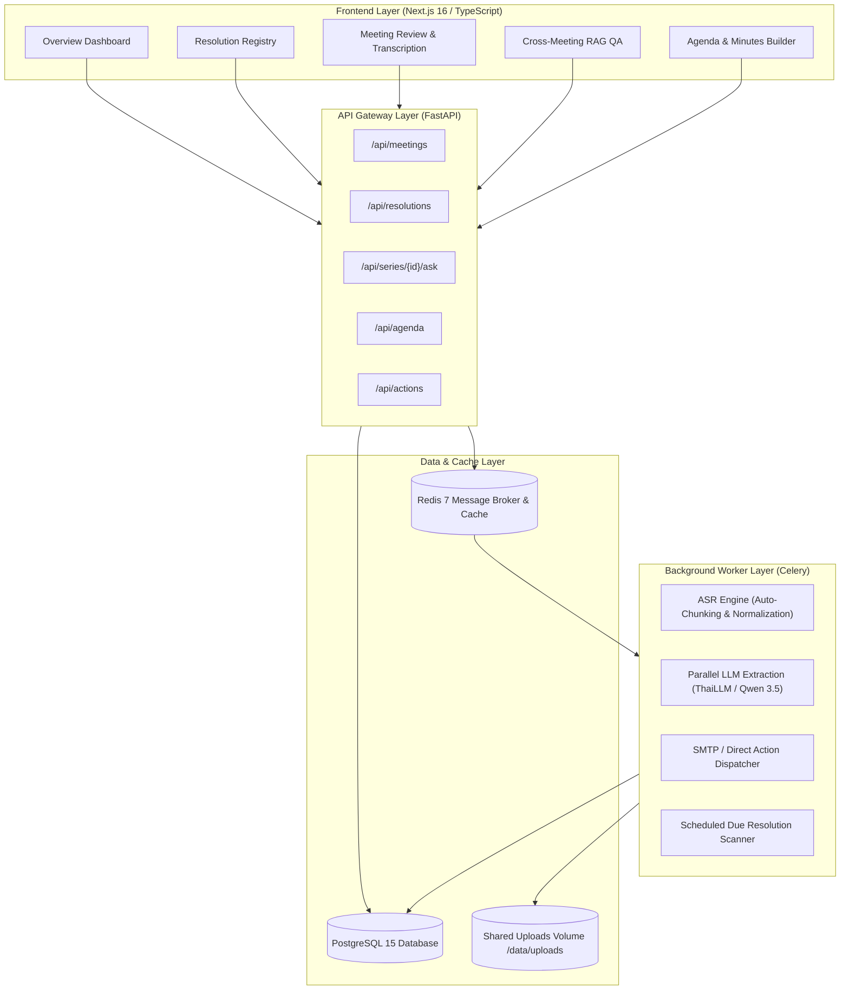

<div align="center">

# SARA · Smart Agenda & Resolution Assistant

**Enterprise-grade AI system for Thai meeting transcription, resolution lifecycle tracking, and official document generation.**

[](https://www.python.org/)
[](https://fastapi.tiangolo.com/)
[](https://nextjs.org/)
[](https://www.postgresql.org/)
[](https://docs.celeryq.dev/)
[](https://www.docker.com/)
[](LICENSE)

[System Architecture](#-system-architecture) · [Prerequisites](#-prerequisites) · [Quick Start with Docker](#-quick-start-with-docker-recommended) · [Local Development](#-local-development-setup) · [Configuration](#-environment-variables) · [Testing](#-testing)

</div>

---

## 📖 Overview

**SARA (Smart Agenda & Resolution Assistant)** transforms organizational meeting workflows. Instead of treating meetings as isolated events, SARA centers on the **Resolution Lifecycle**—automatically extracting decisions, maintaining complete audit trails across meetings, tracking overdue items, and preparing compliant government agenda/minutes documents (`.docx`).

---

## 🏛 System Architecture

SARA employs a multi-tiered, asynchronous microservices architecture designed for reliability, scalability, and strict auditability:



### Core Components

1. **Frontend (`Next.js 16` + `React 19` + `TypeScript`)**
   - High-performance, reactive UI built with Next.js App Router and vanilla CSS design tokens.
   - Interactive meeting review editor with synchronized audio playback, speaker assignment, and resolution validation.
2. **Backend API (`FastAPI` + `SQLAlchemy 2.0 Asyncpg`)**
   - High-throughput asynchronous REST API.
   - Inbound security authentication supporting `API_KEY` header and `Bearer` tokens.
   - Enforced state machines for meeting workflows, resolutions, and audit logging (`X-Actor`).
3. **Background Worker (`Celery` + `Redis 7`)**
   - **Speech-to-Text Pipeline**: Audio pre-validation, dynamic chunking ($\le 10$ mins / $20$ MB), 16kHz mono normalization with FFmpeg, and AI4Thai ASR integration.
   - **Parallel LLM Extraction**: ThreadPool-driven concurrent chunk analysis with target token budgeting and date hallucination suppression.
   - **Scheduled Tasks**: Periodic background scanner for overdue resolutions and reminder dispatching.
4. **Action & Notification Layer (MCP / SMTP)**
   - Tamper-proof magic links signed with HMAC-SHA256 (`SECRET_KEY`) for passwordless resolution status updates.
   - Human-in-the-loop email notification dispatching.
5. **Database & Storage (`PostgreSQL 15` + Shared Storage)**
   - Complete relational integrity, JSONB pipeline stage tracking, and full audit trails.

---

## 📋 Prerequisites

- **Docker & Docker Compose** (version 2.20+)
*OR for standalone local execution:*
- **Python 3.11+**
- **Node.js 20+** and **npm**
- **PostgreSQL 15+**
- **Redis 7+**
- **FFmpeg / FFprobe** (installed on system PATH for audio processing)

---

## ⚙️ Environment Variables

Create a `.env` file in the root directory (copied from `.env.example`):

```bash
cp .env.example .env
```

| Variable | Default Value | Description |
| :--- | :--- | :--- |
| `DATABASE_URL` | `postgresql+asyncpg://postgres:postgrespassword@db:5432/aiaas_db` | PostgreSQL connection string with asyncpg dialect. |
| `REDIS_URL` | `redis://redis:6379/0` | Redis broker and backend URL for Celery. |
| `APP_AI4THAI_API_KEY` | *(Required)* | API Key for AI4Thai Pathumma ASR & ThaiLLM services. |
| `PATHUMMA_BASE_URL` | `https://tokenmind.pathumma.in.th/v1` | Base URL for LLM API Gateway. |
| `PATHUMMA_MODEL_NAME` | `thaillm-8b` | Model name for extraction and QA services. |
| `ASR_URL` | `https://tokenmind.pathumma.in.th` | Endpoint for AI4Thai ASR transcription service. |
| `ASR_MODEL` | `ptm-asr-1` | Model identifier for speech-to-text. |
| `API_KEY` | `""` | *(Optional)* Inbound API Key for securing SARA endpoints. Leave blank for development. |
| `SECRET_KEY` | `change-me-in-production` | Secret key used to sign HMAC-SHA256 magic link tokens. |
| `PUBLIC_BASE_URL` | `http://localhost:8000` | Public base URL used in generated magic links. |
| `UPLOAD_DIR` | `/data/uploads` | Path to shared storage for uploaded audio and documents. |
| `MAX_UPLOAD_MB` | `500` | Maximum allowed audio upload size in MB. |
| `CORS_ORIGINS` | `http://localhost:3000,http://127.0.0.1:3000` | Allowed CORS origins for frontend access. |

---

## 🚀 Quick Start with Docker (Recommended)

Run the entire application stack (PostgreSQL, Redis, Migrations, Backend API, Celery Worker, and Frontend) in one command:

```bash
# 1. Clone the repository
git clone https://github.com/PaweekornS/SARA.git
cd SARA

# 2. Configure your environment
cp .env.example .env
# Edit .env and supply your APP_AI4THAI_API_KEY

# 3. Build and launch all services
docker compose up --build -d
```

### Accessing the Services

- **Web Application UI:** [http://localhost:3000](http://localhost:3000)
- **FastAPI Interactive Docs (Swagger):** [http://localhost:8000/docs](http://localhost:8000/docs)
- **FastAPI Alternative Docs (ReDoc):** [http://localhost:8000/redoc](http://localhost:8000/redoc)

To view service logs:
```bash
docker compose logs -f
```

To stop all services:
```bash
docker compose down
```

---

## 💻 Local Development Setup

If you prefer to run services individually for local development:

### 1. Start Infrastructure Services

Make sure PostgreSQL and Redis are running on your machine:
```bash
# Example using Docker for databases only:
docker run -d --name sara-postgres -p 5432:5432 -e POSTGRES_PASSWORD=postgrespassword -e POSTGRES_DB=aiaas_db postgres:15-alpine
docker run -d --name sara-redis -p 6379:6379 redis:7-alpine
```

### 2. Backend Setup & Migration

```bash
cd backend

# Create and activate Python virtual environment
python -m venv .venv
source .venv/bin/activate  # On Windows: .venv\Scripts\activate

# Install backend dependencies
pip install -r requirements.txt

# Run database migrations and seed initial dataset
alembic upgrade head
python -m app.seed

# Start FastAPI server
uvicorn app.main:app --host 0.0.0.0 --port 8000 --reload
```

### 3. Start Celery Worker

In a separate terminal (with the virtual environment activated):
```bash
cd backend
celery -A app.workers.tasks.celery_app worker --loglevel=info
```

### 4. Frontend Setup

In another terminal:
```bash
cd frontend

# Install Node dependencies
npm install

# Run frontend development server
npm run dev
```

Visit [http://localhost:3000](http://localhost:3000) to use the application.

---

## 🧪 Testing

SARA contains a comprehensive test suite covering API contracts, state transitions, ASR/LLM edge cases, and background pipelines.

```bash
# Run backend test suite
pytest backend/tests/test_services.py -v
```

---

## 📄 License

This project is licensed under the Apache License 2.0 - see the [LICENSE](LICENSE) file for details.
