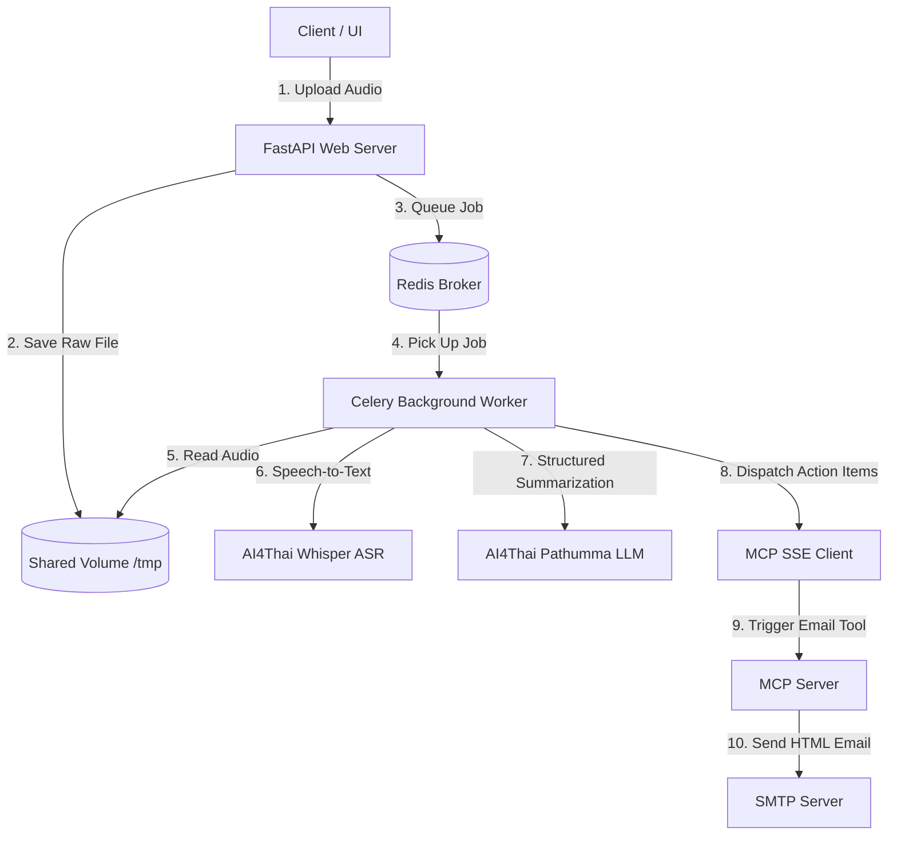

# SARA - Smart Autonomous Record Agent

SARA is an automated meeting transcription, summarization, and action-item dispatcher system. It ingests meeting audio files, transcribes them, extracts structured executive summaries and action items, and automatically sends formatted HTML summary emails to task assignees using a Model Context Protocol (MCP) server.

## Architecture Flow



---

## Configuration (`.env`)

Before running the application, configure your credentials in a `.env` file at the project root. You can copy the example file:
```bash
cp .env.example .env
```

Set the following variables:
```ini
# Database Connection (used by FastAPI and SQLAlchemy)
DATABASE_URL=postgresql+asyncpg://postgres:postgrespassword@db:5432/aiaas_db

# AI4Thai / Pathumma API Config
# Get a key at: https://tokenmind.pathumma.in.th
APP_AI4THAI_API_KEY=your_ai4thai_api_key_here
ASR_URL=https://tokenmind.pathumma.in.th
ASR_MODEL=ptm-asr-1

# SMTP Credentials (sender details for sending action-item emails)
SMTP_HOST=smtp.gmail.com
SMTP_PORT=587
SMTP_USER=your_email@gmail.com
SMTP_PASSWORD=your_app_specific_password_here
```

### Who Receives the Emails?
The email recipients are dynamically determined by the AI summarizer based on the meeting transcript.
- During the meeting, if a speaker assigns a task to someone and mentions their email (e.g., *"Jane will write the docs, send it to jane@example.com"*), the Qwen LLM automatically extracts the task details and the email address.
- The Celery worker then invokes the MCP tool `send_meeting_summary_email` with these extracted emails, sending a custom summary table and list of action items directly to each recipient automatically.

---

## Running with Docker (Recommended)

Docker Compose manages PostgreSQL, Redis, FastAPI, Celery, and the MCP Server.

### 1. Build and Start Services
Run the following command to build the image and start all containers in the background:
```bash
docker compose up --build -d
```

### 2. View Service Logs
```bash
docker compose logs -f
```

### 3. Stop Services
```bash
docker compose down
```

---

## Running Locally

To run the stack locally for development purposes, ensure you have **Python 3.11+**, **PostgreSQL**, **Redis**, and **ffmpeg** installed on your host system.

### 1. Install Dependencies
```bash
pip install -r requirements.txt
```

### 2. Run Redis & PostgreSQL
Ensure your local Redis server is running on port `6379` and PostgreSQL is running on port `5432` with credentials matching your `.env` configuration.

### 3. Run the Services (Separate Terminals)

#### Run the MCP Server
The MCP server hosts the SMTP email dispatcher tool:
```bash
python mcp_server.py
```

#### Run the Celery Background Worker
The worker processes audio file segmenting, transcription calls, summarization, and email agent invocation:
```bash
celery -A app.workers.tasks.celery_app worker --loglevel=info
```

#### Run the FastAPI Web Server
```bash
uvicorn app.main:app --host 0.0.0.0 --port 8000 --reload
```

---

## Usage Guide

1. **Submit a Meeting Audio**:
   Send a POST request to `/api/meetings/process` containing your `.mp3` or `.wav` audio file:
   ```bash
   curl -X POST "http://localhost:8000/api/meetings/process" -F "file=@sample_meeting.mp3"
   ```
   *Response:*
   ```json
   {
     "meeting_id": "b307d645-97c7-4319-806f-f7ddf662f308",
     "status": "QUEUED",
     "message": "Meeting successfully submitted for processing."
   }
   ```

2. **Check Process Status**:
   Poll the status of your meeting using the returned `meeting_id`:
   ```bash
   curl -X GET "http://localhost:8000/api/meetings/b307d645-97c7-4319-806f-f7ddf662f308/status"
   ```

3. **Check Recipient Inbox**:
   Once status is marked as `COMPLETED`, check the inbox of the email addresses mentioned in your audio. They will have received an HTML email summary with formatted action items.
