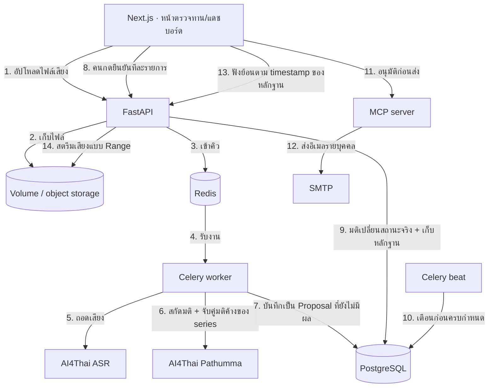

# SARA v2 — ระบบสารบรรณการประชุมอัตโนมัติ

แปลงไฟล์เสียงประชุมเป็นรายงานการประชุมตามระเบียบสารบรรณ และ **ติดตามมติทุกข้อข้ามการประชุมจนกว่าจะปิดจ๊อบ**

v1 = อัดเสียง → สรุป → ยิงเมล → จบ
v2 = **Resolution (มติ) เป็น entity แกนกลาง** ที่มีวงจรชีวิตของตัวเองและอายุยืนกว่าการประชุมที่ให้กำเนิดมัน

รายละเอียดข้อกำหนดทั้งหมดอยู่ใน `business-docs/SARA_v2_Requirements.md`

---

## เริ่มใช้งานใน 3 คำสั่ง

```bash
cp .env.example .env        # ใส่ APP_AI4THAI_API_KEY และ SMTP ของจริง
docker compose up -d --build
# เปิด http://localhost:3000
```

`docker compose` จะรัน migration + สร้างข้อมูลตั้งต้นให้อัตโนมัติ (service `migrate`)

| บริการ | พอร์ต | หน้าที่ |
|---|---|---|
| frontend | 3000 | หน้าจอทั้งหมด (Next.js) |
| backend | 8000 | REST API · เอกสาร OpenAPI ที่ `/api/docs` |
| mcp_server | 8001 | ชั้น action — ทุกอีเมลออกทางนี้ทางเดียว |
| celery_worker | — | ถอดเสียง สกัดมติ จับคู่ข้ามการประชุม ส่งอีเมล |
| celery_beat | — | สแกนมติใกล้ครบกำหนดทุกเช้า สร้างรายการเตือนเข้าคิวรออนุมัติ |
| db · redis | 5432 · 6379 | PostgreSQL · คิวงาน |

> ถ้าเครื่องมี PostgreSQL ของตัวเองอยู่แล้ว พอร์ต 5432 จะชนกัน — แก้ port mapping ใน `docker-compose.yaml` เป็น `5433:5432`

---

## สถาปัตยกรรม



**จุดที่ต่างจากระบบสรุปประชุมทั่วไป:** ขั้นที่ 7–9 ระบบ *เสนอ* ได้อย่างเดียว มติไม่เปลี่ยนสถานะจนกว่าคนจะกดยืนยัน

---

## ฟังย้อนจากจุดที่อ้างอิง

ทุกท่อนคำพูดเก็บ `start_ms`/`end_ms` เป็นคอลัมน์จริงใน `transcript_segment` ไม่ใช่ marker ที่ฝังในข้อความ
จึงตรวจหลักฐานของมติได้ถึงระดับวินาที และ **ฟังเสียงตรงจุดนั้นได้** ไม่ต้องเชื่อข้อความที่ระบบถอดมาอย่างเดียว

| ส่วน | ทำอะไร |
|---|---|
| `GET /api/meetings/{id}/audio` | ส่งไฟล์เสียงต้นฉบับ ตอบ `Range`/`206` ได้ จึงกระโดดไปวินาทีที่ต้องการโดยไม่ต้องโหลดทั้งไฟล์ |
| `components/transcript-player.tsx` | กดบรรทัดไหนก็เล่นตรงนั้น บรรทัดที่หัวอ่านอยู่ถูกเน้น บรรทัดที่ถูกอ้างอิงคาดเส้นตราทอง |
| `?t=<ms>&seg=<id>` บนหน้าการประชุม | เปิดแท็บบันทึกคำต่อคำแล้วจ่อหัวอ่านไว้ที่เวลานั้นให้เลย |

ในหน้าถาม-ตอบ timecode ของทุกรายการอ้างอิงกดได้ — คลิกเดียวจากคำตอบไปถึงเสียงที่พูดจริง

ถ้าอัปโหลดเป็นไฟล์ transcript (ไม่มีเสียง) หรือรันในโหมด mock เครื่องเล่นจะซ่อนตัวเอง ไม่โผล่ปุ่มที่กดแล้วเงียบ

---

## หลักการที่บังคับใช้ในโค้ด ไม่ใช่แค่ในเอกสาร

| หลักการ | บังคับที่ไหน |
|---|---|
| ASR ล้มเหลว = หยุด pipeline ไม่สร้างข้อมูลปลอม (FR-M2-04) | `app/services/asr.py` โยน `AsrError` · `app/workers/tasks.py` ตั้งสถานะ failed |
| ระบบปิดมติเองไม่ได้ (FR-M4-06 · §4.2) | `change_status(system_initiated=True)` ปฏิเสธ done/cancelled |
| ปิดมติต้องมีเหตุผลเสมอ | `app/services/resolutions.py` คืน 422 ถ้าเหตุผลว่าง |
| เปลี่ยนสถานะข้ามขั้นไม่ได้ | `ResolutionStatus.TRANSITIONS` ตาม §4.1 |
| ไม่เดาชื่อคนไทย (§12) | `extraction.resolve_person` คืน None เมื่อชื่อชนกัน แล้วสร้างข้อเสนอถามคนแทน |
| ข้อเสนอปิดมติที่ไม่มั่นใจถูกลดชั้น | `CLOSE_CONFIDENCE_FLOOR` ใน `extraction.py` |
| ห้ามสร้างวาระจากรายงานที่ยังไม่รับรอง (FR-M9-04) | `POST /series/{id}/agenda/generate` คืน 409 |
| ทุกอีเมลต้องผ่านการอนุมัติ (FR-M7-07) | `outbound_action.status` เริ่มที่ `pending_approval` เสมอ |
| อ้างอิงในคำตอบมาจากขั้นค้นหา ไม่ใช่จากโมเดล (FR-M8-02) | `app/services/qa.py` สร้าง citation จากแถวที่ค้นเจอจริง โมเดลแค่เรียบเรียงถ้อยคำ ไม่มีเลขเวลาที่โมเดลแต่งขึ้นให้ต้องมาตรวจ |
| reasoning ของโมเดลต้องไม่หลุดถึงผู้ใช้ | `llm._strip_reasoning` ตัด `<think>…</think>` ถ้าตัดแล้วว่างจะโยน `LlmError` ให้ผู้เรียกใช้คำตอบสำรองแทน |
| อ่านไฟล์เสียงได้แค่ใน `UPLOAD_DIR` | `audio_file.resolve_audio_path` ปฏิเสธ path ที่ชี้ออกนอกโฟลเดอร์ เพราะ `audio_uri` เป็นข้อมูลที่แก้ได้ |

---

## ตรวจสอบก่อนส่งงาน

```bash
cd backend  && python -m unittest discover -s tests   # 38 เคส
cd frontend && npm run check && npm run lint && npm run build
```

`npm run check` ใช้ `--experimental-strip-types` จึงต้องใช้ Node 22 ขึ้นไป
(image ของ frontend เป็น Node 20 — รันคำสั่งนี้บนเครื่องหรือใน container Node 22)

รันชุดเทสต์ฝั่ง backend ใน container ได้ตรง ๆ:

```bash
docker compose exec -w /app backend python -m unittest discover -s tests
```

---

## สิ่งที่ยังไม่ได้ทำ (พูดตามตรง)

| เรื่อง | สถานะ |
|---|---|
| **Auth / multi-tenancy (M10)** | ยังไม่มี — ผู้กระทำมาจากหัวข้อ `X-Actor` ซึ่งปลอมได้ **ต้องทำก่อนใช้งานจริง** |
| **Speaker diarization (FR-M2-06)** | ใช้ speaker label จาก ASR ถ้ามี ถ้าไม่มีให้เลขาฯ ระบุเองในหน้าตรวจทาน (fallback ที่ §M2 อนุญาต) ยังไม่ได้ต่อ pyannote |
| **Q&A แบบ semantic (§14 ข้อ 3)** | ใช้ n-gram ระดับตัวอักษร ยังไม่ได้ใช้ pgvector |
| **template .docx ขององค์กร** | รองรับผ่าน `AGENDA_TEMPLATE_PATH` / `MINUTES_TEMPLATE_PATH` แต่ยังไม่มีไฟล์ต้นแบบจริง |
| **create_jira_issue (FR-M7-05)** | เป็น stub ที่บอกตามตรงว่ายังไม่ได้ต่อระบบจริง |
| **วัดผลตาม §10** | ยังไม่ได้ทำ eval set 20 ไฟล์ ตัวเลข F1 / false close rate จึงยังเคลมไม่ได้ |

