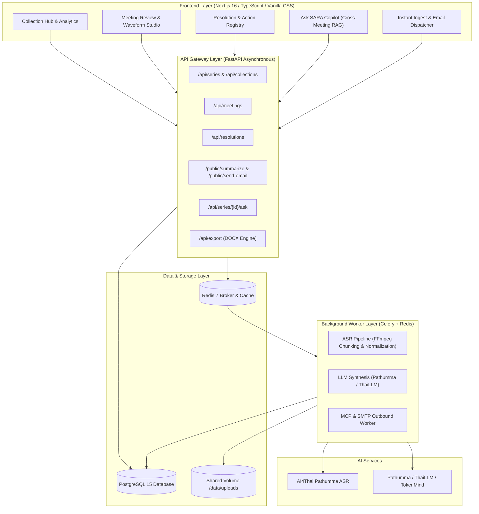

<div align="center">

# SARA · Smart Autonomous Record Agent

**AI-Powered Meeting Intelligence, Action Resolution Tracking & Automated Minutes for Modern Teams, Enterprises, and General Users.**  
*Native integration with AI4Thai Pathumma ASR, ThaiLLM, and Model Context Protocol (MCP) Ecosystem.*

[](https://www.python.org/)
[](https://fastapi.tiangolo.com/)
[](https://nextjs.org/)
[](https://www.postgresql.org/)
[](https://docs.celeryq.dev/)
[](https://www.docker.com/)
[](https://www.ai4thai.in.th/)
[](LICENSE)

[Key Features](#-key-features) · [System Architecture](#-system-architecture) · [Quick Start with Docker](#-quick-start-with-docker-recommended) · [Environment Variables](#-environment-variables) · [Local Development](#-local-development-setup) · [Testing & Verification](#-testing--verification)

</div>

---

## 📖 Overview

**SARA (Smart Agenda & Resolution Assistant)** transforms organizational meeting workflows from disconnected voice notes into an actionable knowledge graph. Whether you are a high-growth startup, a design studio, a tech enterprise, or a cross-functional team, SARA automates speech transcription, resolution tracking, cross-meeting Q&A, and official document generation.

SARA provides:
- **Speech-to-Text with Thai Diarization**: Converts audio recordings into timestamped Thai/English transcripts with speaker detection.
- **Resolution & Action Lifecycle**: Tracks what was agreed upon across multiple meetings, identifying blockers, postponed tasks, and overdue actions.
- **Domain-Specific Templates**: Summarizes discussions according to meeting type (`General`, `Marketing & Growth`, `Finance & Budget`, `Tech Standup & Architecture`).
- **Instant File Summarizer & Email Dispatch**: Stateless upload of audio or documents (.mp3, .m4a, .wav, .docx, .pdf, .txt) with automated email summary distribution.
- **Ask SARA Copilot (Cross-Meeting RAG)**: Conversational assistant answering questions across historical meetings with clickable evidence citations.

---

## ✨ Key Features

```
┌──────────────────────────────────────────────────────────────────────────┐
│                             SARA PLATFORM                                │
├────────────────────────────┬────────────────────────────┬────────────────┤
│ 🎙️ Meeting Studio          │ 🎯 Action Tracking         │ 🤖 AI Copilot  │
│ • Thai ASR (AI4Thai)       │ • Status Lifecycle Engine  │ • Multi-Series │
│ • Speaker Diarization      │ • Blocker & Delay Alerts   │ • Exact Quotes │
│ • Audio-Synced Playback    │ • Passwordless Magic Links │ • Provenance   │
├────────────────────────────┼────────────────────────────┼────────────────┤
│ ⚡ Instant Ingest          │ 📄 Export Engine           │ 📧 Outbound    │
│ • Drag & Drop Audio/Docs   │ • Official Minutes (.docx) │ • SMTP Bot     │
│ • 4 Domain Templates       │ • Automated Agendas        │ • FastMCP      │
│ • No-Login Public API      │ • Buddhist/CE Era Ready    │ • Audit Trail  │
└────────────────────────────┴────────────────────────────┴────────────────┘
```

1. **AI4Thai Pathumma ASR & Audio Normalizer**
   - Automatically chunks long audio files ($\le 10$ mins / $20$ MB) with 16kHz mono normalization using FFmpeg.
   - High-accuracy Thai speech recognition with confidence scoring and fallback protection.
2. **Parallel LLM Extraction Engine**
   - Concurrent chunk analysis powered by ThaiLLM / Pathumma / OpenAI-compatible LLM gateway.
   - Intelligent proposal generation—ensures human review before resolutions are committed to the system of record.
3. **Cross-Meeting Resolution Registry**
   - Maintains continuous action history across series (e.g., *Alpha App Launch Campaign*, *Core Backend Sprints*).
   - Real-time resolution metrics: Overdue tracking, postponement count, and assignee workload analytics.
4. **Interactive Meeting Review Studio**
   - Audio waveform player synchronized with transcript segments.
   - Inline speaker label assignment with self-learning alias registry.
5. **Secure Outbound Action & Email Dispatch**
   - Dispatches formatted meeting summaries and action reminders via SMTP.
   - HMAC-SHA256 magic links for external collaborators to report progress without logging in.

---

## 🏛 System Architecture



---

## 📋 Prerequisites

- **Docker & Docker Compose** (v2.20+)
*OR for standalone manual execution:*
- **Python 3.11+**
- **Node.js 20+** and **npm**
- **PostgreSQL 15+**
- **Redis 7+**
- **FFmpeg / FFprobe** (installed on system PATH for audio processing)

---

## ⚙️ Environment Variables

Create a `.env` file in the project root:

```bash
cp .env.example .env
```

| Variable | Default Value | Description |
| :--- | :--- | :--- |
| `DATABASE_URL` | `postgresql+asyncpg://postgres:postgrespassword@db:5432/aiaas_db` | PostgreSQL connection string (asyncpg). |
| `REDIS_URL` | `redis://redis:6379/0` | Redis broker URL for Celery queues. |
| `APP_AI4THAI_API_KEY` | *(Your AI4Thai Key)* | API Key for AI4Thai Pathumma ASR & ThaiLLM services. |
| `PATHUMMA_BASE_URL` | `https://tokenmind.pathumma.in.th/v1` | Base URL for LLM API Gateway. |
| `PATHUMMA_MODEL_NAME` | `thaillm-8b` | Model name for extraction and cross-meeting QA. |
| `ASR_URL` | `https://tokenmind.pathumma.in.th` | Endpoint for AI4Thai ASR transcription service. |
| `ASR_MODEL` | `ptm-asr-1` | Model identifier for speech-to-text. |
| `SMTP_SERVER` | `smtp.gmail.com` | Outbound SMTP server hostname. |
| `SMTP_PORT` | `587` | SMTP port (STARTTLS). |
| `SMTP_USER` | `sara.meeting.bot@gmail.com` | SMTP authentication user. |
| `SMTP_PASSWORD` | *(App Password)* | SMTP application password. |
| `SECRET_KEY` | `change-me-in-production` | Secret key for signing HMAC magic tokens. |
| `PUBLIC_BASE_URL` | `http://localhost:8000` | Public URL for magic link callbacks. |
| `UPLOAD_DIR` | `/data/uploads` | Path to shared storage for audio and documents. |
| `MAX_UPLOAD_MB` | `500` | Maximum audio upload file size in MB. |
| `CORS_ORIGINS` | `http://localhost:3000,http://127.0.0.1:3000` | Allowed CORS origins for web clients. |

---

## 🚀 Quick Start with Docker (Recommended)

Run the full SARA platform (PostgreSQL, Redis, Database Migrations, FastAPI Backend, Celery Worker, and Next.js Frontend) in one command:

```bash
# 1. Clone repository
git clone https://github.com/PaweekornS/SARA.git
cd SARA

# 2. Set environment configuration
cp .env.example .env
# Edit .env and enter your APP_AI4THAI_API_KEY and SMTP credentials

# 3. Launch platform
docker compose up --build -d
```

### Accessing SARA Services

- **Web Application:** [http://localhost:3000](http://localhost:3000)
- **FastAPI Interactive Docs (Swagger UI):** [http://localhost:8000/docs](http://localhost:8000/docs)
- **FastAPI Alternative Docs (ReDoc):** [http://localhost:8000/redoc](http://localhost:8000/redoc)

```bash
# Check service logs in real time
docker compose logs -f

# Reset demo dataset (NovaTech Studio) inside the backend container
docker compose exec backend python -m app.seed --reset

# Stop all services
docker compose down
```

---

## 💻 Local Development Setup

To run services standalone during development:

### 1. Start Database & Redis

```bash
docker run -d --name sara-postgres -p 5432:5432 -e POSTGRES_PASSWORD=postgrespassword -e POSTGRES_DB=aiaas_db postgres:15-alpine
docker run -d --name sara-redis -p 6379:6379 redis:7-alpine
```

### 2. Backend Setup & API Server

```bash
cd backend

# Create and activate virtual environment
python -m venv .venv
source .venv/bin/activate  # On Windows: .venv\Scripts\activate

# Install dependencies
pip install -r requirements.txt

# Run migrations and seed NovaTech Studio dataset
alembic upgrade head
python -m app.seed

# Start FastAPI development server
uvicorn app.main:app --host 0.0.0.0 --port 8000 --reload
```

### 3. Start Celery Background Worker

In a separate terminal:
```bash
cd backend
source .venv/bin/activate
celery -A app.workers.tasks.celery_app worker --loglevel=info
```

### 4. Frontend Setup

In another terminal:
```bash
cd frontend

# Install Node dependencies
npm install

# Start Next.js development server
npm run dev
```

Visit [http://localhost:3000](http://localhost:3000) to open the interactive UI.

---

## 🧪 Testing & Verification

SARA includes automated test suites covering pure unit logic, API serialization, Thai typography/date formatting, and background ingestion pipelines.

```bash
# Run backend service test suite
cd backend
python -m unittest tests.test_services -v

# Run frontend domain unit tests
cd ../frontend
node --experimental-strip-types --test lib/domain.test.ts

# Run frontend production build check
npm run build
```

---

## 📁 Repository Structure

```
SARA/
├── backend/
│   ├── app/
│   │   ├── api/             # FastAPI route controllers (series, meetings, public, export)
│   │   ├── core/            # Config, security, and logging
│   │   ├── db/              # SQLAlchemy 2.0 async models and session
│   │   ├── services/        # ASR, LLM extraction, docx export, QA RAG, email MCP
│   │   ├── workers/         # Celery tasks (audio chunking, extraction, dispatch)
│   │   ├── mcp_server.py    # FastMCP server for direct email delivery
│   │   └── seed.py          # Demo workspace data seeder (NovaTech Studio)
│   ├── tests/               # Backend unit & integration test suites
│   └── requirements.txt
├── frontend/
│   ├── app/                 # Next.js App Router pages (collections, meetings, ask, audit)
│   ├── components/          # React components (app-shell, meeting-ingest, ui)
│   ├── lib/                 # Types, state store, domain logic, API clients, seed data
│   └── package.json
├── docker-compose.yml       # Production & development container orchestration
├── Dockerfile.backend       # Multi-stage Python backend container
├── Dockerfile.frontend      # Multi-stage Next.js production build container
├── Mock_Data_Update.md      # NovaTech Studio demo specifications & mock data
└── README.md
```

---

## 📄 License

This project is licensed under the Apache License 2.0 - see the [LICENSE](LICENSE) file for details.
