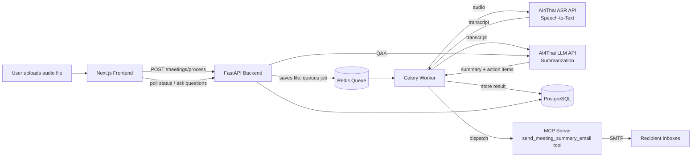

# SARA — Architecture

## Tech stack

| Layer | Technology |
|---|---|
| Frontend | Next.js 16.2.12 (App Router), React 19.2.4, TypeScript, Tailwind CSS v4 |
| Backend API | Python 3.11, FastAPI |
| Background jobs | Celery, with Redis as the message broker/result store |
| Database | PostgreSQL 15, accessed via SQLAlchemy (async) |
| Speech-to-text | AI4Thai / Pathumma hosted ASR API (model: `ptm-asr-1`) |
| Summarization / Q&A | AI4Thai / Pathumma hosted LLM API (model configured as `thaillm-8b`; referred to as "Qwen 3.5" in the README and some code comments — this naming is inconsistent in the current codebase) |
| Task-dispatch protocol | Model Context Protocol (MCP), via the `fastmcp` framework |
| Email delivery | SMTP (configured by default against Gmail's SMTP servers) |
| Containerization | Docker + Docker Compose (6 services: web app, API, worker, MCP server, Postgres, Redis) |
| Cloud/infra provider | ไม่มีข้อมูลเพียงพอ — no cloud provider (AWS/GCP/Azure) is configured anywhere in the repo; the system currently runs via local Docker Compose only |

## System diagram

## External paid / metered dependencies

| Service | What it's used for | How cost scales |
|---|---|---|
| **AI4Thai / Pathumma API** | Speech-to-text (every uploaded meeting) + LLM summarization (every meeting) + LLM Q&A (every chat question) | Usage-based: cost grows with number of meetings processed and number of chat questions asked. Exact pricing per request is not documented anywhere in this repo — ไม่มีข้อมูลเพียงพอ for a cost-per-meeting estimate. |
| **SMTP (Gmail by default)** | Sending the summary email to each recipient | The system is currently wired to Gmail's SMTP with an app password, which is a free but rate-limited option intended for personal/low-volume use. There is no cost line item in code, but Gmail-based sending is not designed for high-volume commercial email and would need to move to a transactional email provider before scaling. |
| **PostgreSQL, Redis** | Data storage, job queue | Self-hosted via Docker in the current setup — no managed/paid cloud database is configured. Cost would only appear once/if this moves to a managed cloud database service. |

No other paid third-party APIs (no cloud storage, no payment processor, no analytics/observability SaaS) were found in the codebase.

## Current scalability profile

This is an honest, code-derived assessment — not a stress-tested benchmark.

- **Single-instance by design.** The Docker Compose file defines exactly one instance each of the API, Celery worker, and MCP server, with no replica or autoscaling configuration. Concurrent meeting processing is limited by however many Celery worker processes are running on one machine.
- **File storage is local disk, not durable/shared.** Uploaded audio files are written to a temporary local folder inside the container. This works for a single-machine demo but would break in any multi-instance deployment (a worker on a different machine couldn't read a file uploaded to another instance) and offers no durability guarantee.
- **No database migration tooling.** Tables are created automatically at startup (`Base.metadata.create_all`) rather than through versioned migrations (e.g., Alembic). This is fine for a single evolving demo database but is a real blocker for safely evolving the schema once real data exists in production.
- **No authentication/authorization enforced.** A database table and a verification function for API keys exist in the code but are not actually applied to any endpoint. Anyone who can reach the API can use it — this is a demo-appropriate state, not a multi-tenant-ready one.
- **No caching layer beyond the job queue.** Redis is used only as the Celery broker, not as an application cache, so every summary/Q&A request goes through the paid LLM API directly.

**Bottom line:** the current build is appropriately architected for a single-team demo or pilot (one organization, moderate meeting volume, trusted users). Supporting multiple concurrent organizations, high meeting volume, or public-internet exposure would require: durable/shared file storage (e.g., object storage), authentication enforced on the API, database migrations, and horizontal scaling of the worker tier — none of which exist yet. ไม่มีข้อมูลเพียงพอ to state a specific concurrent-user ceiling, since no load testing exists in the repo.
