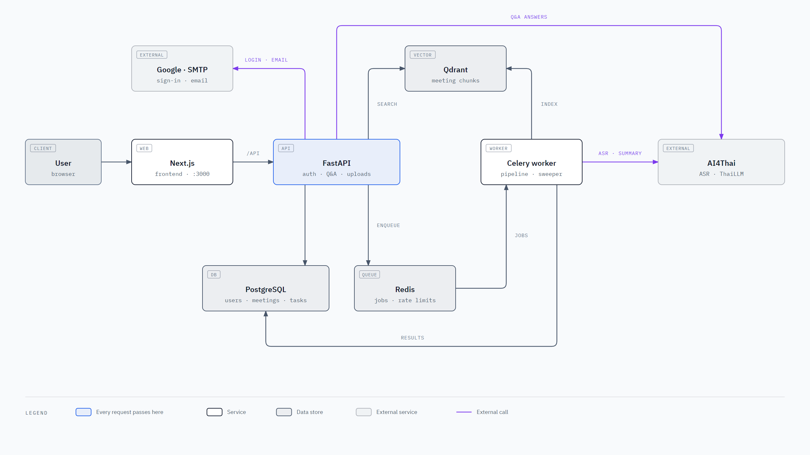
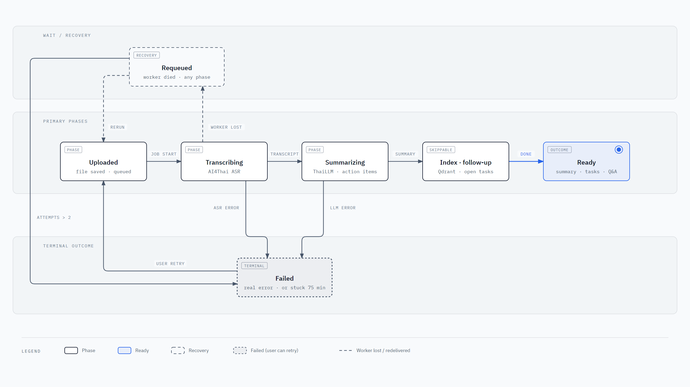

# Development guide

## Architecture

<picture>
  <source media="(prefers-color-scheme: dark)" srcset="diagrams/architecture-dark.png">
  
</picture>

- **Accounts:** Google Sign-In. Each user sees only their own data.
- **Q&A:** hybrid search. Qdrant matches meaning; keyword search catches names and numbers. If Qdrant is down, keyword search still answers.
- **Embeddings:** multilingual MiniLM on CPU, baked into the backend image.

### Processing lifecycle

<picture>
  <source media="(prefers-color-scheme: dark)" srcset="diagrams/lifecycle-dark.png">
  
</picture>

Transcription and summarizing must succeed, or the meeting is marked failed; nothing is made up. Indexing and the open-task check are optional: if they fail, the meeting is still ready.

Diagram sources are the HTML files in [`diagrams/`](diagrams/).

## Configuration

Copy `.env.example` to `.env`.

| Variable | Purpose |
| --- | --- |
| `APP_POSTGRES_PASSWORD` | Database password |
| `APP_SECRET_KEY` | Signs login sessions. Generate: `python -c "import secrets; print(secrets.token_urlsafe(48))"` |
| `APP_AI4THAI_API_KEY` | AI4Thai ASR and LLM |
| `GOOGLE_CLIENT_ID` | Google OAuth client ID (Web application) |
| `APP_SMTP_USER`, `APP_SMTP_PASSWORD` | SMTP login. Empty means emails are only logged |
| `ENV` | `dev` enables demo login and `/docs`. `prod` disables them and requires a strong secret key and a Google client ID |
| `SESSION_COOKIE_SECURE` | `true` when served over HTTPS |
| `ROOT_PATH` | Path prefix when a reverse proxy serves the API under a sub-path (e.g. `/api`). Empty locally |
| `CORS_ORIGINS` | Allowed frontend origins, comma-separated |
| `DATABASE_URL` | Only for running the backend outside Docker |

Tuning (see `backend/app/core/config.py`): `PUBLIC_SUMMARIZE_PER_HOUR`, `EMAIL_RECIPIENTS_PER_DAY`, `MEETING_TIME_LIMIT_MINUTES`, `VECTOR_MIN_SCORE`, `EMBEDDING_MODEL`.

## Running without Docker

Needs Python 3.11+, Node 20+, FFmpeg, and running PostgreSQL, Redis and Qdrant.

```bash
# backend
cd backend
python -m venv .venv && source .venv/bin/activate   # Windows: .venv\Scripts\activate
pip install -r requirements-dev.txt
alembic upgrade head && python -m app.seed
uvicorn app.main:app --reload --port 8000

# worker (second terminal)
celery -A app.workers.tasks.celery_app worker -B --loglevel=info

# frontend (third terminal)
cd frontend && npm install && npm run dev
```

Useful Docker commands: `docker compose logs -f api worker`, `docker compose down`.

## Tests

```bash
# backend: needs a throwaway PostgreSQL (Qdrant and the embedding model are faked)
docker run -d --name sara_test_db -e POSTGRES_PASSWORD=postgrespassword \
  -e POSTGRES_DB=sara_test -p 55432:5432 postgres:15-alpine
cd backend && python -m unittest discover -s tests -t . -v

# frontend
cd frontend && npm run check && npm run build
```

## Project layout

```
backend/
  app/
    api/        routes: auth, collections, meetings, action-items, public
    services/   ASR, LLM summarize, Q&A, Qdrant, docx export, email, rate limits
    workers/    Celery pipeline
    db/         SQLAlchemy models
  alembic/      database migrations
  tests/
frontend/       Next.js app
docs/           this guide and diagrams
```
